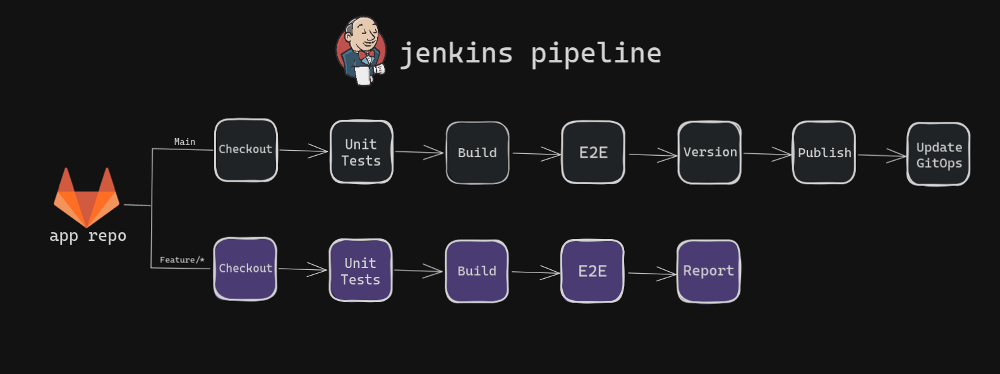
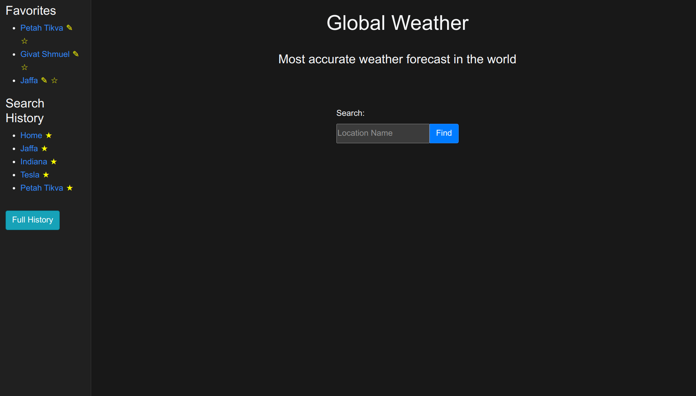

# Application repository

This repository contains the source code for the portfolio project's application. The application is built using Python and Flask, exposing a REST API and interacting with a MongoDB database.
The repository also includes a Jenkinsfile for automating the CI/CD pipeline.

# Jenkins Pipeline



# App Demo



## Structure

```text
├── src                        # Source directory for application code
│   ├── static                 # Directory for static files
│   │   └── style.css          # CSS file for styling the application
│   ├── templates              # Directory for HTML templates
│   │   ├── index.html         # Main HTML template for the home page
│   │   └── your_locations.html# HTML template for displaying saved locations
│   ├── __init__.py            # Initialize the Flask app
│   ├── config.py              # Configuration settings
│   ├── helpers.py             # Helper functions
│   ├── main.py                # Main application file
│   ├── routes.py              # Blueprint for routes
│   ├── run.py                 # Entry point for running the app
│   └── test.py                # Test file for unit tests
├── Jenkinsfile                # Jenkins pipeline configuration
├── docker-compose.yaml        # Docker Compose configuration for local development and testing
├── Dockerfile                 # Dockerfile for building the application's Docker image
├── Dockerfile-nginx           # Dockerfile for building the Nginx image to serve static files
├── nginx                      # Directory for Nginx configuration
│   └── nginx.conf             # Nginx configuration file
└── requirements.txt           # Python dependencies
```
