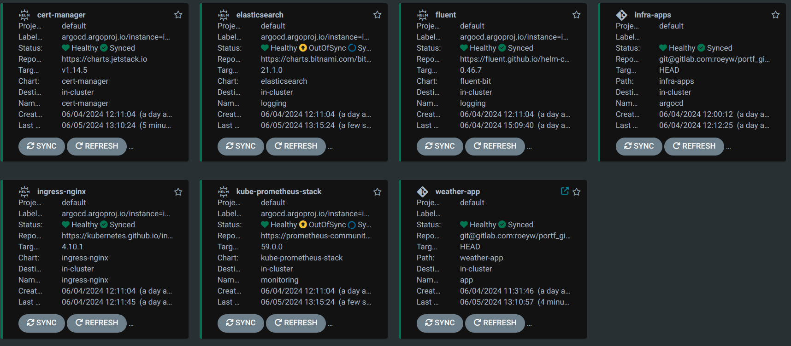

# GitOps Repository

This repository contains the GitOps configuration for deploying and managing the application and the infrastructure applications and services on a Kubernetes cluster using Argo CD.

# Full Architecture


# Argocd View



# Grafana Dashboard


# Kibana Dashboard


## Structure

```text
├── infra-apps                             # Directory for infrastructure applications
│   ├── cert-manager.yaml                  # Configuration for cert-manager
│   ├── elasticsearch.yaml                 # Elasticsearch deployment configuration
│   ├── fluentd.yaml                       # Fluent-bit configuration for log forwarding
│   ├── ingress-controller.yaml            # Nginx ingress controller configuration
│   ├── prometheus-stack.yaml              # Prometheus stack deployment configuration
│   ├── values                             # Directory for Helm values files
│   │   ├── elastic-values.yaml            # Values for Elasticsearch
│   │   ├── fluent-values.yaml             # Values for Fluent-bit
│   │   ├── prometheus-values.yaml         # Values for Prometheus
├── weather-app                            # Directory for the weather application Helm chart
│   ├── charts                             # Directory for imported Helm charts
│   │   └── mongodb-15.3.0.tgz             # MongoDB Helm chart package
│   ├── Chart.yaml                         # Helm chart metadata
│   ├── crds                               # Custom Resource Definitions (CRDs)
│   │   └── cert-manager.crds.yaml         # CRD for cert-manager
│   ├── templates                          # Directory for Kubernetes manifest templates
│   │   ├── cert-issuer.yaml               # Template for certificate issuer
│   │   ├── configmap.yaml                 # Template for ConfigMap
│   │   ├── deployment.yaml                # Template for application deployment
│   │   ├── ingress.yaml                   # Template for ingress resource
│   │   └── service.yaml                   # Template for service resource
│   └── values.yaml                        # Values file for the weather application Helm chart
├── weather-app.yaml                       # Main configuration for the weather application
├── infra-apps.yaml                        # Main configuration for infrastructure applications
├── info.md                                # Notes and useful commands
```
